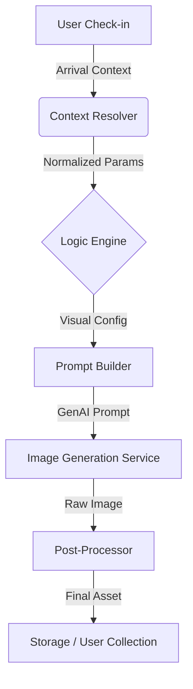

# Digital Passport Generation Engine Specification

## 1. System Overview

**Objective**: To generate unique, high-fidelity digital passport stamp images in real-time based on a user's arrival context (Location, Time, Weather).

**Core Philosophy**: Procedural generation of "analog imperfections". The engine does not just place a PNG icon; it simulates the *act* of stamping on paper, including ink bleed, texture interaction, and human error.

### 1.1 Architecture



---

## 2. Input Data Model

The engine expects a standard `ArrivalContext` payload.

```typescript
interface ArrivalContext {
  // Location
  city: string;        // e.g., "Tokyo"
  airportCode: string; // e.g., "HND"
  lat: number;
  lng: number;

  // Temporal
  timestamp: string;   // ISO 8601, e.g., "2026-02-13T09:15:00Z"
  localTime: string;   // HH:mm format, e.g., "09:15"

  // Environmental
  weather: {
    condition: 'clear' | 'rain' | 'cloudy' | 'snow' | 'storm';
    temperature: number; // Celsius
    humidity: number;    // 0-100% (Crucial for ink bleed logic)
  };
}
```

---

## 3. Logic Engine: Mapping Context to Visuals

The Logic Engine transforms raw `ArrivalContext` into `VisualParameters`. This is where the aesthetic decisions are made.

### 3.1 Mood Resolution Logic

| Arrival Context | Defined Mood |
| :--- | :--- |
| **06:00 - 11:00** AND **Clear/Cloudy** | `CRISP_MORNING` |
| **Any Time** AND **Rain/Storm** | `MOOD_RAIN` |
| **20:00 - 05:00** (Night) | `NEON_NIGHT` |
| *Default Fallback* | `CRISP_MORNING` |

### 3.2 Visual Parameter Interface

```typescript
interface VisualParameters {
  // Shape & Structure
  shape: 'circle' | 'rounded_rect' | 'hexagon';
  rotation: number;     // Degrees (e.g., 1.2) - Random variance applied here
  
  // Ink Properties
  primaryInkColor: string; // Hex code
  secondaryInkColor?: string;
  inkOpacity: number;      // 0.0 - 1.0
  inkBleedLevel: 'low' | 'medium' | 'high';
  
  // Texture
  paperGrain: 'standard' | 'heavy' | 'wet';
  imperfections: string[]; // e.g., ["smudge", "ghosting", "misregistration"]
  
  // Content
  landmark: string;       // "Mt. Fuji"
  icon: string;          // "sun_rays" or "umbrella"
  serialCode: string;     // Generated string e.g., "HND-0915-M"
}
```

---

## 4. Prompt Engineering Templates

The `Prompt Builder` uses Liquid/Mustache-style templates to generate the final string for the AI model (Flux/Midjourney).

### 4.1 Master Template Structure (Pseudo-code)

```mustache
Macro photography of a {{ print_technique }} rubber stamp impression on {{ paper_type }} paper.
{{ texture_description }}

STAMP DESIGN - "{{ mood_name }}":
- Shape: {{ shape_description }}
- Primary ink: {{ primary_color_name }} ({{ primary_hex }}), {{ opacity }}% opacity
{{#secondary_ink}}
- Secondary ink: {{ secondary_color_name }} ({{ secondary_hex }}), {{ offset_description }}
{{/secondary_ink}}

IMAGERY:
- Center: {{ landmark_description }}
- Text: "{{ city_name_en }} {{ city_name_native }}"
- Details: {{ icon_description }}

INK BEHAVIOR:
{{ ink_behavior_block }}

TECHNICAL:
{{ tech_specs }}
```

### 4.2 Mood-Specific Configuration Blocks

#### A. `CRISP_MORNING`
- **Print Technique**: "risograph-printed"
- **Texture**: "Ultra-realistic paper grain texture visible throughout"
- **Ink Behavior**:
    > "High contrast, crisp definition. Ink looks 'wet' and fresh. Slight over-inking creates darker pooling in dense areas. Visible halftone dots in solid areas."

#### B. `MOOD_RAIN`
- **Print Technique**: "risograph-printed with moisture effects"
- **Texture**: "Heavy paper grain with moisture effects, paper appears humid"
- **Ink Behavior**:
    > "Edges are SOFT and FEATHERED like watercolor bleeding into wet paper. Visible 'water bloom' effect (asymmetric ink spreading). Ink pooling in dense areas. 4px feathered atmospheric halo."

#### C. `NEON_NIGHT`
- **Print Technique**: "dual-color risograph"
- **Texture**: "Subtle halftone dot pattern suggesting night photography grain"
- **Ink Behavior**:
    > "Double-exposure effect. Chromatic aberration from misregistration creates RGB separation glow. Heavy embossing from pressure. Visible fingerprint smudge."

---

## 5. City Configuration Schema

To scale to new cities, the engine requires a configuration file `cities.json`.

```json
{
  "tokyo": {
    "name_en": "TOKYO",
    "name_native": "東京",
    "landmarks": {
      "morning": "Minimalist geometric line art of Mt. Fuji with sunrise rays",
      "rain": "Tokyo Tower silhouette with rain streaks",
      "night": "Abstract geometric lines of Shibuya Crossing"
    },
    "colors": {
      "primary_day": "#D97242",
      "primary_rain": "#546E7A",
      "primary_night": "#1A1A1A"
    }
  },
  "paris": {
    "name_en": "PARIS",
    "name_native": "PARIS",
    "landmarks": {
      "morning": "Line art of Eiffel Tower with sunburst",
      "rain": "Montmartre stairs with umbrella silhouette",
      "night": "Abstract Louvre Pyramid geometry"
    },
    "colors": {
      "primary_day": "#C2410C", // Burnt Orange
      "primary_rain": "#475569", // Slate
      "primary_night": "#0F172A" // Midnight
    }
  }
}
```

---

## 6. Implementation Strategy

### Phase 1: MVP (Server-Side Generation)
1.  **Backend**: Node.js / Python worker.
2.  **Context**: Receives webhook from client app upon arrival.
3.  **Generation**: Calls Image Gen API (e.g., OpenAI/Flux) with constructed prompt.
4.  **Storage**: Saves unique PNG to S3/Cloud Storage.
5.  **Delivery**: Returns URL to client.

### Phase 2: Client-Side Compositing (Optimization)
To reduce API costs and latency:
1.  **Base Assets**: Pre-generate high-res blank stamp shapes (Circle, Hexagon) with textures but *no text/icon*.
2.  **Dynamic Overlay**: Use Canvas/Skia (server-side) to composite the specific text, date, and icons onto the textured base.
3.  **Benefit**: Instant generation, zero marginal cost per stamp.
4.  **Trade-off**: Less "organic" ink bleeding between text and texture.

**Recommendation**: Start with Phase 1 for maximum quality and "wow" factor, as the organic ink bleed is the core value proposition.

---

## 7. Future Extensions

- **Special Events**: "Cherry Blossom" variation for Tokyo in April.
- **Rarity System**: 1% chance to generate a "Gold Foil" stamp variation.
- **Passport Pages**: Logic to place stamps on specific coordinates of a virtual 24-page booklet.
