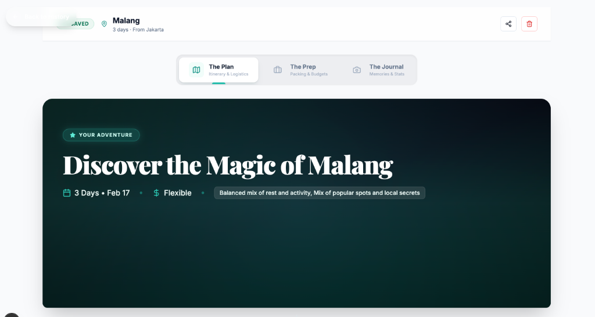
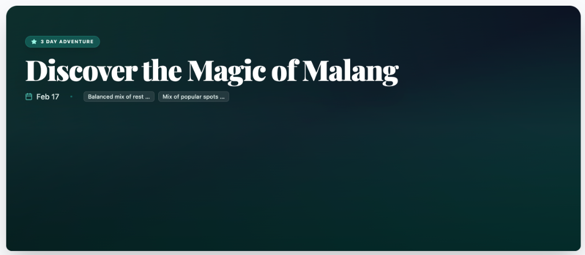
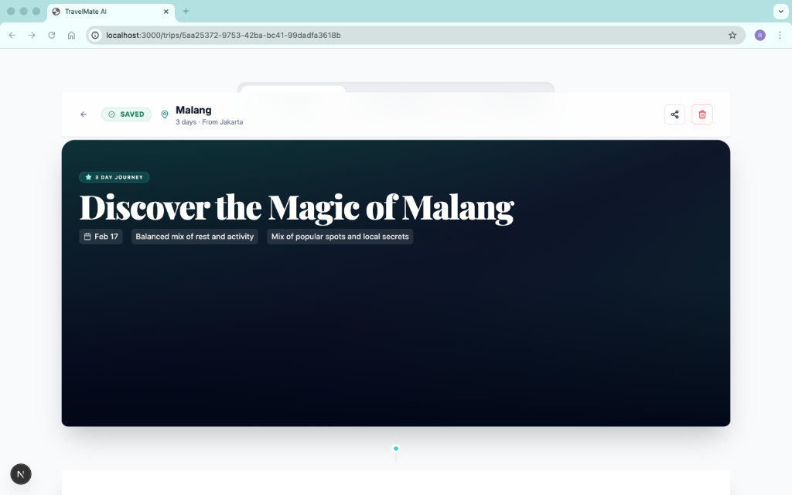

# Koleksi Mockup UI TravelMate

Dokumen ini berisi kumpulan mockup UI yang telah dikembangkan untuk proyek TravelMate, berfokus pada estetika premium, editorial, dan pengalaman pengguna yang intuitif.

---

## 🔒 1. Premium Login Experience
Konsep login dengan estetika premium yang menggunakan tipografi elegan dan visual yang imersif.

*Desktop Concept: Menggunakan efek parallax dan tipografi serif yang elegan untuk kesan premium.*

*Mobile Concept: Fokus pada kemudahan akses dan visual yang membangkitkan keinginan untuk traveling.*

---

## 🛠️ 2. Advanced Trip Customization (TravelMate Copilot)
Fitur sinkronisasi logistik dan personalisasi itinerary berdasarkan preferensi user.

### A. Customization Modal

*Global Preferences: Modal untuk mengatur budget tier (Low/Med/High), gaya aktivitas, dan pantangan makanan.*

### B. Inline Activity Actions

*Direct Interaction: User dapat mengganti (Replace), menghapus (Delete), atau menambah aktivitas langsung dari timeline.*

### C. Activity Replacement Drawer

*Hybrid Engine: Drawer yang muncul untuk memberikan alternatif aktivitas cerdas jika user ingin mengganti itinerary.*

---

## 🎫 3. Trip Overview Card (V2)
Evolusi desain kartu ringkasan trip untuk efisiensi informasi dan estetika magazine-style.

*V2 Concept: Menggunakan layout split dengan image latar belakang yang lebih dramatis dan badge status.*

*Minimal Option: Fokus pada tipografi dan keterbacaan tinggi dengan pembersihan elemen dekoratif yang berlebih.*

*Integration: Bagaimana kartu ringkasan berpadu dengan layout detail perjalanan secara keseluruhan.*

---

## 📖 4. Editorial Trip Story (Core Concepts)
Konsep awal narasi perjalanan yang membagi itinerary ke dalam beberapa "Phase".

*Phase 1: The Promise - Kartu hero dengan Journey Arc dan statistik utama.*

*Phase 2: The Highlights - Menampilkan 3 pengalaman tak terlupakan.*

*Phase 3: The Blueprint - Penjelasan tema per hari yang interaktif.*

---

## 🎨 Design Tokens & UI Specs (Developer Reference)

### Colors
- **Primary Teal:** `#0f766e` (teal-700)
- **Accent Mint:** `#14b8a6` (teal-500)
- **Dark Surface:** `#0f172a` (slate-900)
- **Glass Backdrop:** `rgba(255, 255, 255, 0.7)` with `backdrop-blur-md`

### Components Location
- **Itinerary Timeline:** `src/components/business/ItineraryTimeline.tsx`
- **Trip Results:** `src/components/business/TripResult.tsx`
- **Overview Card:** `src/components/common/TripOverviewCard.tsx`
