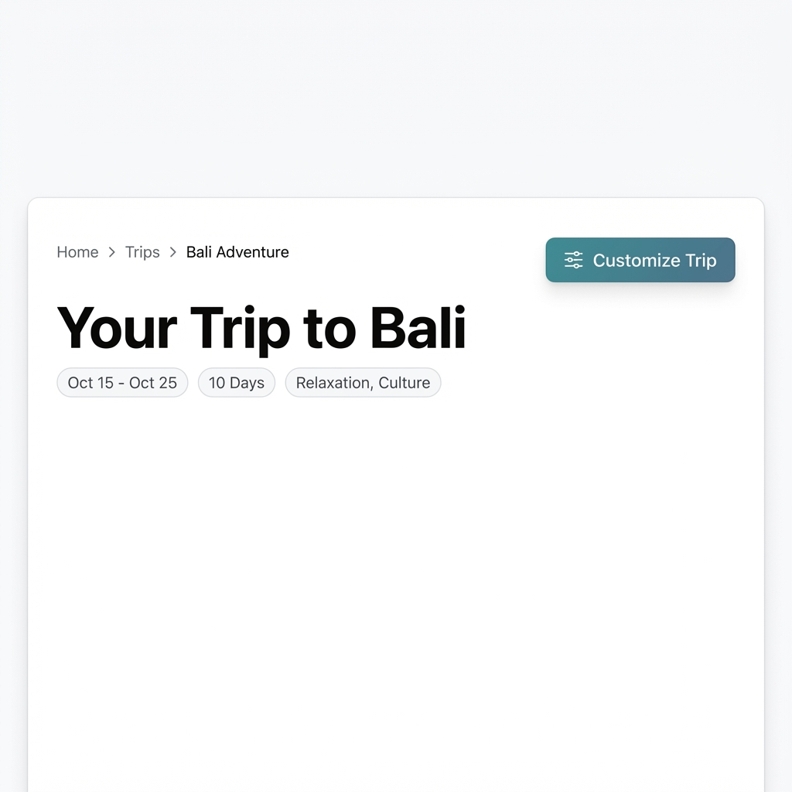
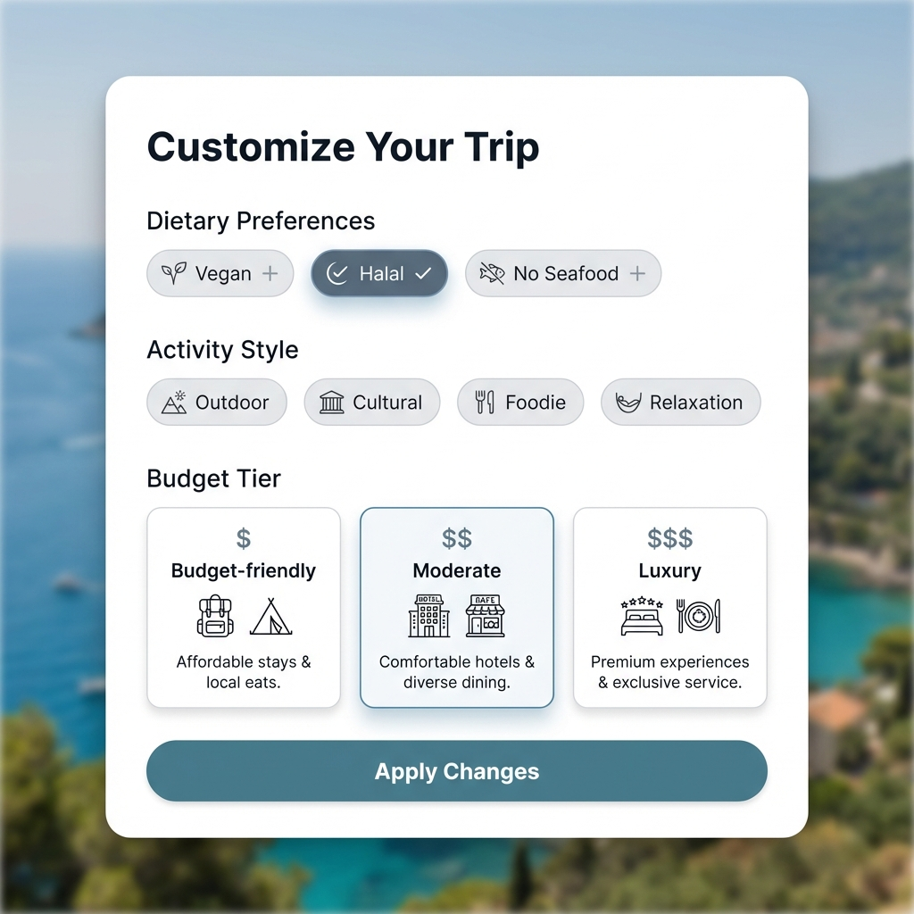
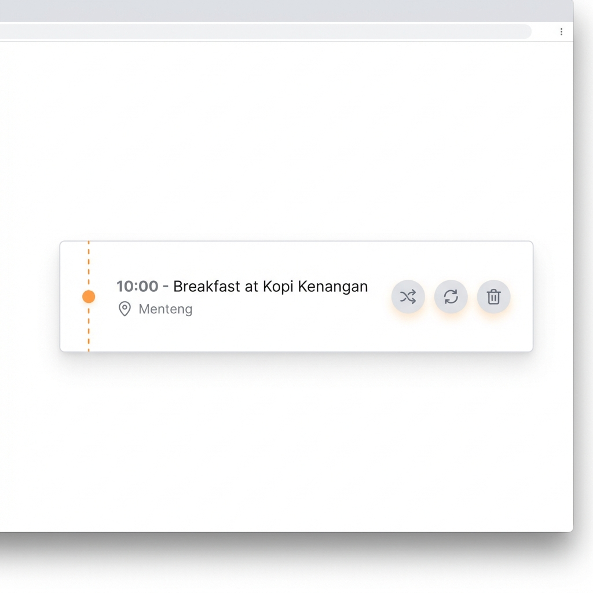
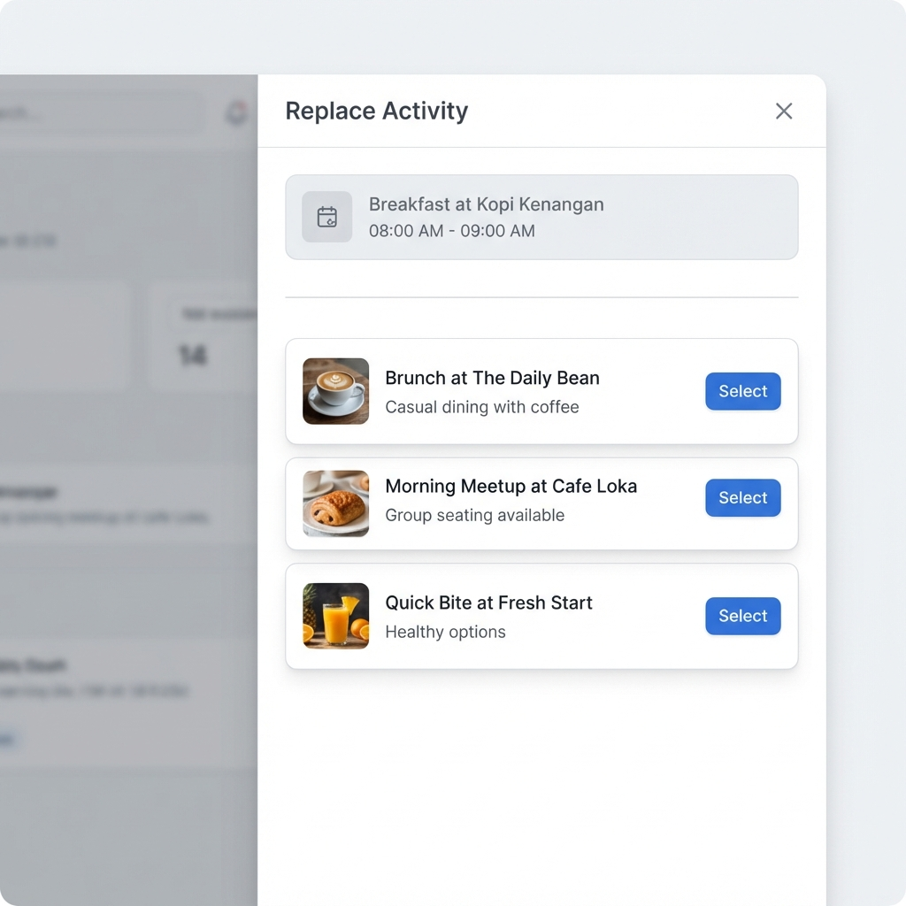

# TravelMate Copilot: Visual Design Mockups

Dokumen ini berisi spesifikasi visual untuk fitur interaktif TravelMate, termasuk kustomisasi tag dan aksi inline pada aktivitas.

---

## 🎨 Design Overview

Desain ini mengintegrasikan dua pola modifikasi pelengkap ke dalam halaman TripResult:
1. **Tag Customization Modal** - Untuk perubahan preferensi global (Budget, Dietary, Style).
2. **Inline Action Buttons** - Untuk pengeditan spesifik pada setiap aktivitas.

---

## 1️⃣ Customization Entry Point

### **Component:** `CustomizeTripButton`
**Location:** TripHeader component (top right)

**Specifications:**
- **Button Style:** Teal/slate background (`bg-teal-600`)
- **Label:** "Customize Trip" dengan icon filter/sliders.
- **Action:** Membuka customization modal.

---

## 2️⃣ Tag Customization Modal

### **Component:** `TripCustomizationModal`

**Specifications:**
- **Background:** White dengan backdrop blur.
- **Border Radius:** `rounded-3xl`.
- **Sections:** Dietary Preferences (Pills), Activity Style (Multi-select), dan Budget Tier (Radio-style cards).

---

## 3️⃣ Inline Activity Actions

### **Component:** Enhanced `ActivityCard`

**Interaksi:**
- Tombol muncul saat **hover**.
- **Replace (↻)**: Membuka replacement drawer.
- **Delete (🗑️)**: Menghapus aktivitas.
- **Add Below (+)**: Menambah aktivitas setelahnya.

---

## 4️⃣ Activity Replacement Drawer

### **Component:** `ActivityReplacementDrawer`

**Specifications:**
- **Type:** Slide-over dari kanan.
- **Content:** Menampilkan aktivitas asli (grayed out) dan daftar saran alternatif dengan tombol "Select".
